# 📎 AttachmentWrapper
## 🚀 SAP BTP Integration Suite (CPI) – Trabalhando com AttachmentWrapper

📌 Visão Geral

Este projeto demonstra, na prática, como construir um iFlow no SAP BTP Integration Suite utilizando conceitos avançados de integração.

O cenário implementado realiza a conversão de valores em USD para BRL, combinando dados de entrada com uma API externa de câmbio em tempo real.

<br>


---

📸 Caso de Uso Real

Esse tipo de cenário é comum em integrações corporativas onde:

É necessário enriquecer dados com informações externas

Processar dados em paralelo para otimizar performance

Consolidar múltiplas fontes em um único payload

---


# :building_construction: Arquitetura do iFlow

### :one: O fluxo foi desenvolvido no SAP Cloud Integration (CPI) seguindo as etapas abaixo.
<br><br>
### Criando Manage Security
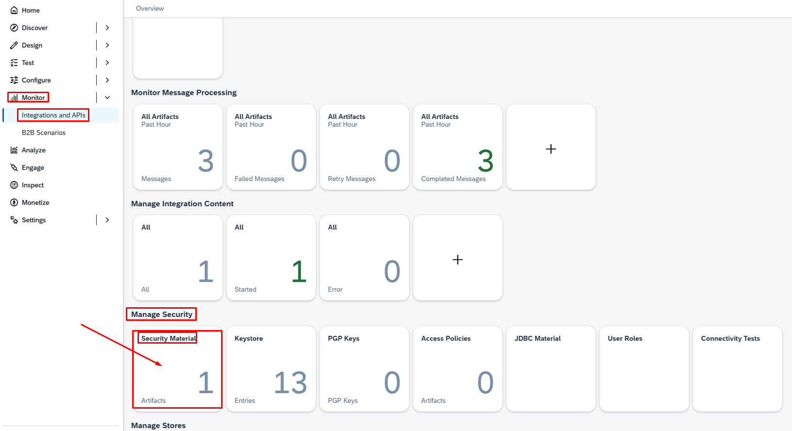
<br><br><br>

### Criando o User Credentials
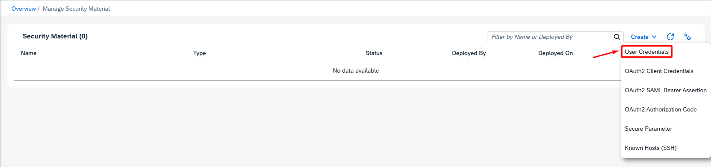

<br><br>

### Criando o User Credenials
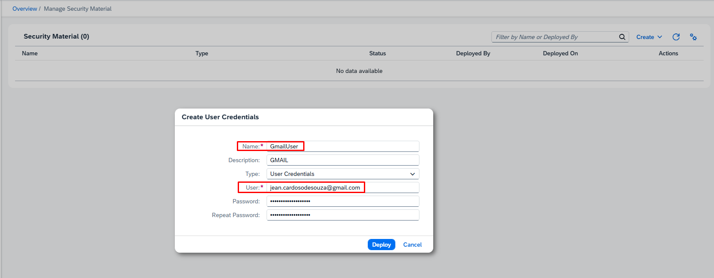
```
GmailUser
```

<br><br>

### Criando o Integration Flow


<br><br>
:gear: Etapas da Integração

<br>

### :two:  Editar o Iflow

### Criando o Pacote
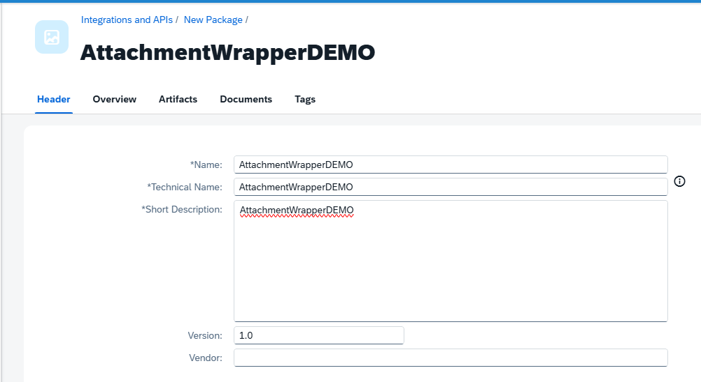
```
AttachementWrapperDEMO
```
<br>

### Criar nosso Integration Flow
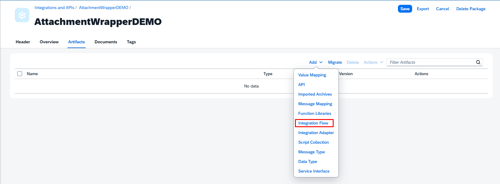

<br>

### Criar nosso Repositorio do Integration Flow
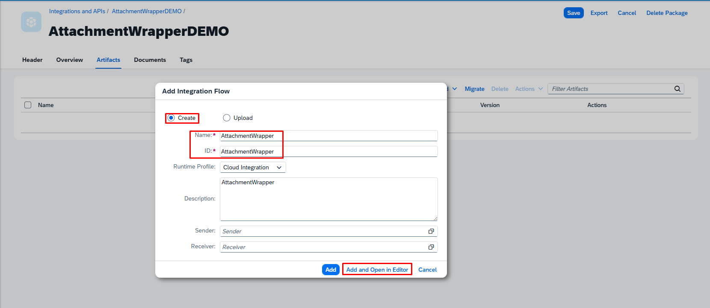

<br>

### :three:  HTTPS Sender
### Adicionando o HTTPS
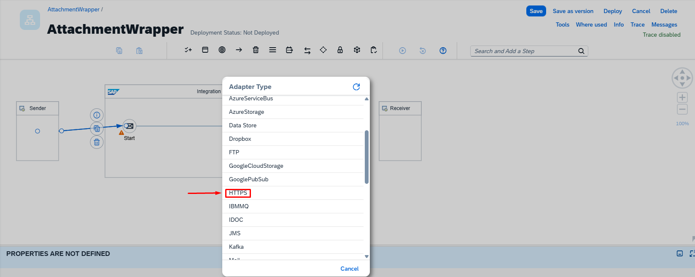

<br>


### Configurando o HTTPS
O fluxo é iniciado através de um endpoint HTTPS, permitindo que aplicações externas consultem o serviço.
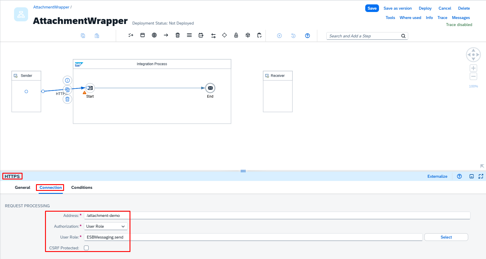
```
Address: /attachment-demor
```
<br>

### :four:  JSON to XML Converter

<br>

### Adicionando o Groovy Script
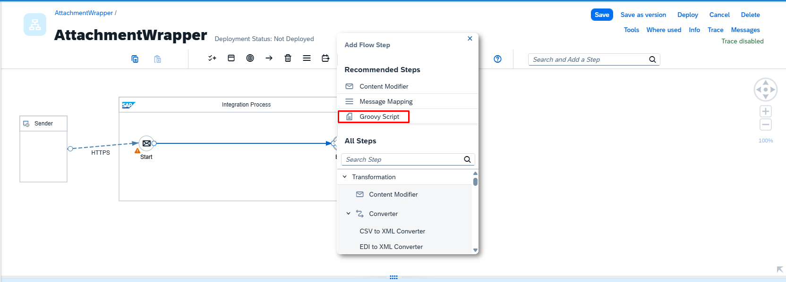

<br>

### Renomeando o Groovy Script
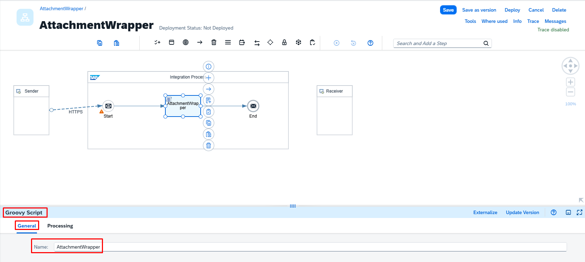
```
AttachmentWrapper
```

<br>

### Criando nosso arquivo Groovy Script

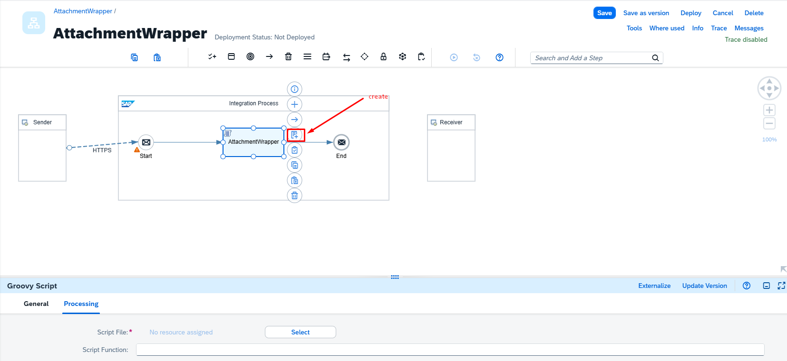

<br>

### Adicionadno nosso script do Groovy Script
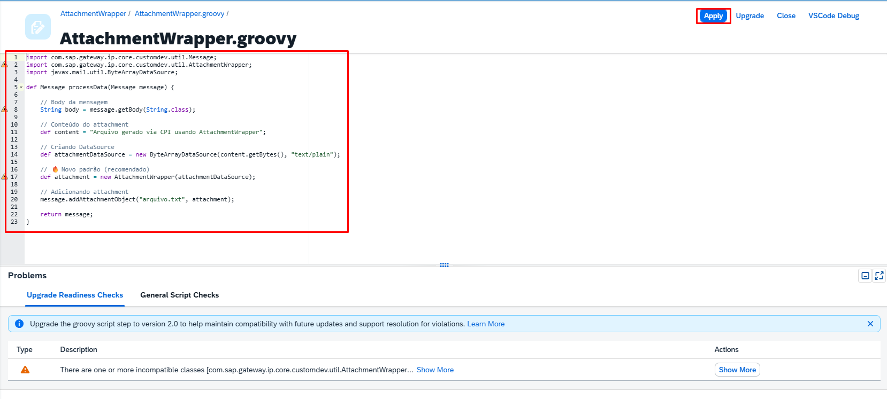
```
import com.sap.gateway.ip.core.customdev.util.Message;
import com.sap.gateway.ip.core.customdev.util.AttachmentWrapper;
import javax.mail.util.ByteArrayDataSource;

def Message processData(Message message) {

    // Body da mensagem
    String body = message.getBody(String.class);

    // Conteúdo do attachment
    def content = "Arquivo gerado via CPI usando AttachmentWrapper";

    // Criando DataSource
    def attachmentDataSource = new ByteArrayDataSource(content.getBytes(), "text/plain");

    // 🔥 Novo padrão (recomendado)
    def attachment = new AttachmentWrapper(attachmentDataSource);

    // Adicionando attachment
    message.addAttachmentObject("arquivo.txt", attachment);

    return message;
}
```
<br>

### Adicionando Mail
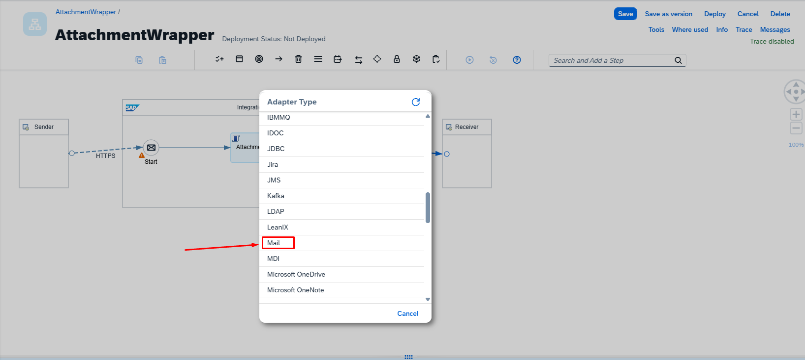

<br>

### Configurando o Mail Connection
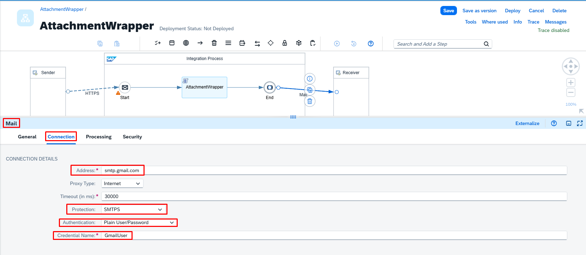
```
Address: smtp.gmail.com
Credential Name: GmailUser
```
<br>

### Configurando o Mail Processing
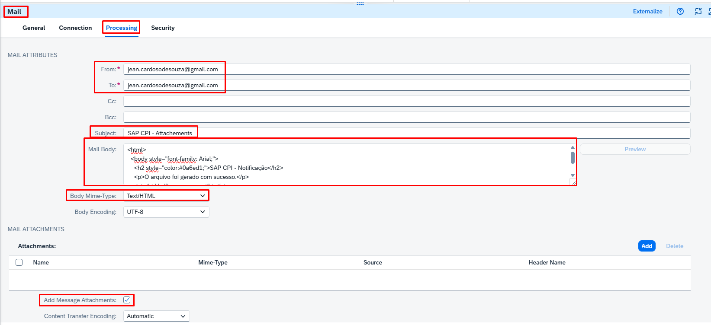
```
Subject: SAP CPI Attachment
Mail Body:
<html>
  <body style="font-family: Arial;">
    <h2 style="color:#0a6ed1;">SAP CPI - Notificação</h2>
    <p>O arquivo foi gerado com sucesso.</p>
    <p><b>Verifique o anexo.</b></p>
  </body>
</html>

Body Mime Type: Text/HTML

Add Message Attachements: marcar
```

<br>

### Email Recebido com o anexo
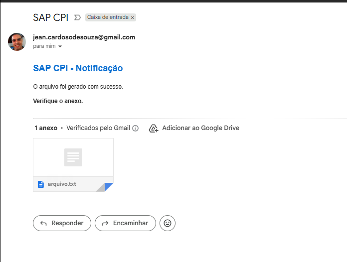

<br>

### Anexo gerado pelo Groovy Script
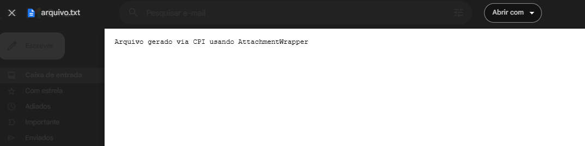


<br>
<br>

---

## 📦 Exemplo prático – iFlow para baixar

📦 [Download do iFlow – Converter-USDxBRL](https://github.com/souzajean/Converter-USDxBRL/raw/main/Package/ConvertendoDollarparaReal.zip)


> O arquivo pode ser importado diretamente no SAP Integration Suite (CPI).

